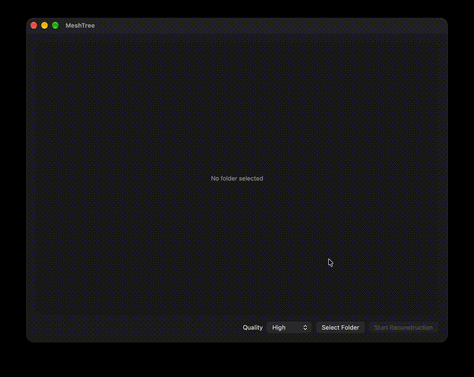

# Meshtree

Meshtree turns an overlapping photoset of an object into a 3D model locally.



**[Download the latest build](https://github.com/raiyan-islam-dev/Meshtree/releases/latest)**

## Quick start

1. Download the .dmg file from releases and drag the Meshtree app into your Applications folder.
2. If macOS refuses to open the app and says Apple could not verify "MeshTree" is free of malware that may harm your Mac or compromise your privacy, go to System Settings, Privacy & Security, scroll down to the bottom and click Open Anyway.
3. Open the app, click Select Folder and select a folder containing your overlapping photoset.
4. Choose a quality preset and hit Start Reconstruction.
5. The process is decently heavy on memory so try to make sure enough memory is free.
6. Once done, you'll get your 3D model and there's also an option to save a .usdz file.

## Sample Datasets

Here's a photoset to test with:
- [Apple Object Capture sample (36 photos of a rock)](https://developer.apple.com/documentation/realitykit/creating-a-photogrammetry-command-line-app) — download the sample project, the photoset is in `Data/Rock36Images.zip`

## Features

- Clean view of all the photos so you can spot bad photos.
- Local 3D model reconstruction.
- 3D preview.
- One click .usdz export.
- Cancel mid reconstruction.

## Running locally

Requirements:
- macOS Ventura (13) or later, **Apple Silicon strongly recommended**. The app checks `PhotogrammetrySession.isSupported` on launch and will tell you if your Mac can't run it.
- Xcode 26 or later

```bash
git clone https://github.com/raiyan-islam-dev/Meshtree.git
cd Meshtree
open MeshTree.xcodeproj
```

Select the MeshTree scheme in Xcode and press **⌘R** to run it.

## How it works

Meshtree uses Apple's Object Capture and `PhotogrammetrySession` to reconstruct the 3D model. Meshtree is an app built around it to handle the photos, grid, quality, progress, preview and export.

When you hit Start Reconstruction, it first checks if your Mac supports photogrammetry. Then it creates a temp folder, copies the photos from the grid into it, and starts the reconstruction with the chosen quality preset while showing a progress bar. Once it's done, it shows the 3D model and deletes the temporary copies of the photos.

## Credits

Built with Apple's [RealityKit Object Capture](https://developer.apple.com/documentation/realitykit/realitykit-object-capture) and [SceneKit](https://developer.apple.com/documentation/scenekit). Made for [Stardance](https://stardance.hackclub.com), by Hack Club.

## AI usage

AI was used to learn debugging, to polish and draft this README, and for some code snippets.

## License

MIT, see [LICENSE](LICENSE).