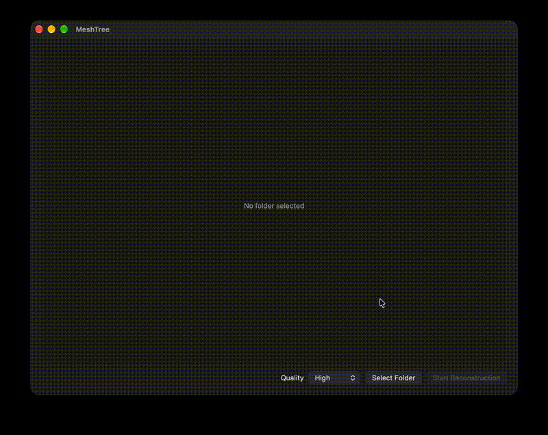

# MeshTree

MeshTree turns an overlapping photoset into 



## Quick start

1. Download the .dmg file from releases.
2. If macOS refuses to open the app, go to system settings, Privacy & security, scroll down to the bottom and click Open Anyway.
3. After opening the app, click Select Folder button and select a folder containing a photoset.
4. Choose a quality preset.
5. Click "Start Reconstruction".
6. The memory usage is pretty heavy, so try to make sure there's enough memory free.
7. After the reconstruction is done, a preview will show the 3D model and there's also a button for saving the model as .usdz file.

## Sample Dataset

Here's a dataset to test with:
- Click [this Apple page](https://developer.apple.com/documentation/realitykit/creating-a-photogrammetry-command-line-app), hit the Download button, unzip it. Inside you'll find a `Data` folder, and inside that a `Rock36Images.zip`, unzip that too, and you've got your photoset

## Features

- Organised view of all photos.
- Completely local.
- .usdz export.

## Running Locally

Requirements:
- macOS Ventura (13) or later, **Apple Silicon strongly recommended**. The app checks `PhotogrammetrySession.isSupported` on launch and will tell you if your Mac can't run it.
- Xcode 26 or later

```bash
git clone https://github.com/raiyan-islam-dev/Meshtree.git
cd Meshtree
open MeshTree.xcodeproj
```

## How it works

MeshTree is based on Apple's Object Capture. It uses Apple's `PhotogrammetrySession` to make the 3D model.

When reconstruction starts, it first checks if your Mac supports photogrammetry. If it does, it creates a temporary folder, copies the photos from the grid into it, and starts reconstruction with the chosen quality preset. Once it's done, it shows a preview of the 3D model, allowing you to save it, and then deletes the temporary file

## Credits

Built with Apple's [RealityKit Object Capture](https://developer.apple.com/documentation/realitykit/realitykit-object-capture) and [SceneKit](https://developer.apple.com/documentation/scenekit). Made for [Stardance](https://stardance.hackclub.com), by Hack Club.

## AI usage

AI was used to learn debugging and for some code snippets. 

## License

MIT, see [LICENSE](LICENSE).